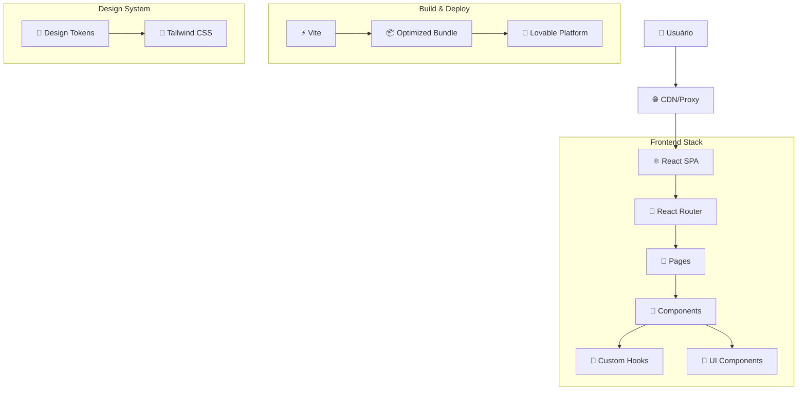
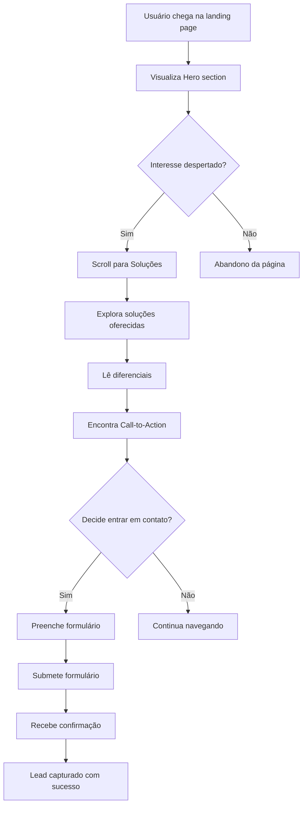
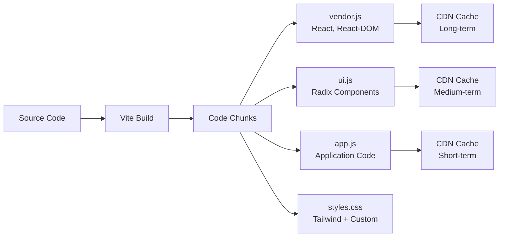

# Documentação Técnica Completa - Logge Tecnologia

## 📋 Índice

1. [Visão Geral do Projeto](#-visão-geral-do-projeto)
2. [Arquitetura Técnica](#️-arquitetura-técnica)
3. [Componentes e APIs](#-componentes-e-apis)
4. [Sistema de Design](#-sistema-de-design)
5. [Fluxos de Usuário](#-fluxos-de-usuário)
6. [Configuração e Setup](#-configuração-e-setup)
7. [Deploy e CI/CD](#-deploy-e-cicd)
8. [Guia de Contribuição](#-guia-de-contribuição)
9. [Performance e Monitoramento](#-performance-e-monitoramento)
10. [Segurança e Conformidade](#-segurança-e-conformidade)
11. [Troubleshooting](#-troubleshooting)
12. [Roadmap e Melhorias](#-roadmap-e-melhorias)

---

## 🎯 Visão Geral do Projeto

A aplicação da **Logge Tecnologia** é uma landing page corporativa desenvolvida em React que apresenta os serviços de consultoria da empresa. O projeto utiliza tecnologias modernas para criar uma experiência de usuário fluida e responsiva, com foco em conversão e engajamento.

### Objetivo do Negócio
- ✅ Apresentar os serviços de consultoria especializada
- ✅ Capturar leads através de formulários de contato
- ✅ Demonstrar diferenciais competitivos
- ✅ Facilitar agendamento de consultorias gratuitas

### Status da Aplicação
- **Estado**: Produção ativa
- **URL**: https://lovable.dev/projects/34b3fbd2-d99f-4c11-9b2c-9220c7284342
- **Versão**: 1.0.0
- **Última atualização**: 2024

---

## 🏗️ Arquitetura Técnica

### Stack Tecnológico

| Tecnologia | Versão | Propósito |
|------------|--------|-----------|
| **React** | ^18.3.1 | Framework principal para UI |
| **TypeScript** | ^5.5.3 | Tipagem estática e maior robustez |
| **Vite** | ^5.4.1 | Bundler e dev server |
| **Tailwind CSS** | ^3.4.11 | Framework CSS utilitário |
| **Radix UI** | ^1.x | Componentes acessíveis e headless |
| **React Router DOM** | ^6.26.2 | Roteamento SPA |
| **React Query** | ^5.56.2 | Gerenciamento de estado server |
| **React Hook Form** | ^7.53.0 | Gerenciamento de formulários |
| **Lucide React** | ^0.462.0 | Biblioteca de ícones |

### Estrutura de Diretórios

```
src/
├── components/           # Componentes React
│   ├── ui/              # Componentes base (shadcn/ui)
│   │   ├── button.tsx   # Sistema de botões
│   │   ├── input.tsx    # Campos de entrada
│   │   ├── card.tsx     # Sistema de cards
│   │   └── ...          # Outros componentes UI
│   ├── Hero.tsx         # Seção hero da landing page
│   ├── Navbar.tsx       # Navegação principal
│   ├── Solutions.tsx    # Apresentação de soluções
│   ├── Differentials.tsx # Diferenciais competitivos
│   ├── CallToAction.tsx # Chamadas para ação
│   ├── ContactForm.tsx  # Formulário de contato
│   └── Footer.tsx       # Rodapé
├── hooks/               # Hooks customizados
│   ├── useScrollReveal.ts # Animações de scroll reveal
│   ├── use-mobile.tsx   # Detecção de dispositivos móveis
│   └── use-toast.ts     # Sistema de notificações
├── lib/                 # Utilitários e helpers
│   └── utils.ts         # Funções utilitárias
├── pages/               # Páginas da aplicação
│   ├── Index.tsx        # Página principal
│   └── NotFound.tsx     # Página 404
├── App.tsx             # Componente raiz
├── main.tsx            # Entry point
└── index.css           # Estilos globais e design tokens
```

### Padrões Arquiteturais

#### 1. Component-Driven Development
- Cada componente possui uma responsabilidade única e bem definida
- Separação clara entre lógica de apresentação e negócio
- Composição sobre herança

#### 2. Design System First
- Uso de tokens semânticos centralizados
- Componentes reutilizáveis com variants
- Consistência visual em toda aplicação

#### 3. Performance-Oriented
- Lazy loading automático via Vite
- Bundle splitting inteligente
- Otimizações de renderização

#### 4. Accessibility-First
- Componentes Radix UI garantem conformidade WCAG
- Navegação por teclado
- Screen reader compatibility

### Diagrama de Arquitetura



---

## 🧩 Componentes e APIs

### Componentes Principais

#### 1. Navbar Component
**Localização**: `src/components/Navbar.tsx`

**Responsabilidades**:
- Navegação principal da aplicação
- Menu responsivo para dispositivos móveis
- Efeitos de scroll (padding dinâmico)
- Links de navegação suave (smooth scroll)

**Estados Internos**:
```typescript
interface NavbarState {
  isMenuOpen: boolean;    // Controla menu mobile
  isScrolled: boolean;    // Detecta scroll para efeitos
}
```

**Funcionalidades**:
- ✅ Navegação fixa no topo
- ✅ Auto-hide padding ao scroll
- ✅ Menu hamburger responsivo
- ✅ Smooth scroll para âncoras
- ✅ Logo com destaque da marca

#### 2. Hero Component
**Localização**: `src/components/Hero.tsx`

**Responsabilidades**:
- Primeira impressão visual da marca
- Apresentação da proposta de valor
- Call-to-actions primários
- Animações de entrada (scroll reveal)

**Animações**:
```typescript
// Três elementos com delays escalonados
const { ref: titleRef, isVisible: titleVisible } = useScrollReveal();
const { ref: subtitleRef, isVisible: subtitleVisible } = useScrollReveal();
const { ref: buttonsRef, isVisible: buttonsVisible } = useScrollReveal();

// Delays aplicados via CSS inline
style={{ transitionDelay: '200ms' }}  // Subtitle
style={{ transitionDelay: '400ms' }}  // Buttons
```

#### 3. Solutions Component
**Localização**: `src/components/Solutions.tsx`

**Estrutura de Dados**:
```typescript
interface Solution {
  icon: LucideIcon;
  title: string;
  description: string;
}

const solutions: Solution[] = [
  {
    icon: Building,
    title: "Consultoria Empresarial",
    description: "Análise e otimização de processos..."
  },
  // ... outras soluções
];
```

**Layout Responsivo**:
- **Mobile**: 1 coluna (grid-cols-1)
- **Tablet**: 2 colunas (md:grid-cols-2)
- **Desktop**: 3 colunas (lg:grid-cols-3)

#### 4. ContactForm Component
**Localização**: `src/components/ContactForm.tsx`

**Interface de Dados**:
```typescript
interface ContactFormData {
  name: string;
  email: string;
  phone: string;
  company: string;
  message: string;
}
```

**Validações Implementadas**:
- Campos obrigatórios (name, email, message)
- Formato de email válido
- Comprimento mínimo para mensagem
- Sanitização automática via React

### Hooks Customizados

#### useScrollReveal
**Localização**: `src/hooks/useScrollReveal.ts`

**API**:
```typescript
interface UseScrollRevealOptions {
  threshold?: number;           // Padrão: 0.1
  rootMargin?: string;         // Padrão: '0px 0px -50px 0px'
}

interface UseScrollRevealReturn {
  ref: RefObject<HTMLDivElement>;
  isVisible: boolean;
}

const useScrollReveal = (
  threshold?: number, 
  rootMargin?: string
): UseScrollRevealReturn;
```

**Exemplo de Uso**:
```typescript
const Component = () => {
  const { ref, isVisible } = useScrollReveal(0.1, '0px 0px -50px 0px');

  return (
    <div
      ref={ref}
      className={`scroll-reveal ${isVisible ? 'revealed' : ''}`}
    >
      <h2>Conteúdo animado</h2>
    </div>
  );
};
```

### Componentes UI (shadcn/ui)

#### Button Component
**Variants Disponíveis**:
```typescript
const buttonVariants = {
  variant: {
    default: "bg-primary text-primary-foreground hover:bg-primary/90",
    destructive: "bg-destructive text-destructive-foreground",
    outline: "border border-input bg-background hover:bg-accent",
    secondary: "bg-secondary text-secondary-foreground hover:bg-secondary/80",
    ghost: "hover:bg-accent hover:text-accent-foreground",
    link: "text-primary underline-offset-4 hover:underline",
  },
  size: {
    default: "h-10 px-4 py-2",
    sm: "h-9 rounded-md px-3",
    lg: "h-11 rounded-md px-8",
    icon: "h-10 w-10",
  }
}
```

#### Card Component
**Composição**:
```typescript
<Card>
  <CardHeader>
    <CardTitle>Título do Card</CardTitle>
    <CardDescription>Descrição opcional</CardDescription>
  </CardHeader>
  <CardContent>
    <p>Conteúdo principal do card</p>
  </CardContent>
  <CardFooter>
    <Button>Ação</Button>
  </CardFooter>
</Card>
```

---

## 🎨 Sistema de Design

### Tokens de Design

O sistema de design está centralizado em `src/index.css` e `tailwind.config.ts`, utilizando variáveis CSS para manter consistência e facilitar manutenção.

#### Paleta de Cores

```css
/* Cores da marca Logge */
--logge-light-blue: #1EAEDB    /* Azul principal */
--logge-dark-blue: #0E76A8     /* Azul secundário */
--logge-gray-100: #F6F6F7      /* Cinza claro */
--logge-gray-400: #403E43      /* Cinza escuro */

/* Cores semânticas (HSL) */
--primary: 195 82% 49%         /* HSL do azul principal */
--background: 0 0% 100%        /* Fundo claro */
--foreground: 222.2 84% 4.9%   /* Texto principal */
```

#### Tipografia

**Famílias**:
- **Montserrat**: Headings e títulos (font-montserrat)
- **Inter**: Corpo de texto e UI (font-inter)

**Escalas**:
```css
.section-title {
  font-size: clamp(1.875rem, 4vw, 2.25rem);
  font-weight: 700;
  margin-bottom: 1rem;
  color: var(--logge-dark-blue);
  text-wrap: balance;
  line-height: 1.2;
}

.section-subtitle {
  font-size: 1.25rem;
  color: var(--logge-gray-400);
  max-width: 48rem;
  margin: 0 auto 2.5rem;
  line-height: 1.6;
}
```

#### Sistema de Sombras

```css
.shadow-soft {
  box-shadow: 0 4px 20px -4px rgba(30, 174, 219, 0.1);
}

.shadow-medium {
  box-shadow: 0 8px 30px -8px rgba(30, 174, 219, 0.15);
}

.shadow-strong {
  box-shadow: 0 12px 40px -12px rgba(30, 174, 219, 0.2);
}
```

### Animações e Microinterações

#### Scroll Reveal System
```css
.scroll-reveal {
  opacity: 0;
  transform: translateY(32px);
  transition: all 0.7s ease-out;
}

.scroll-reveal.revealed {
  opacity: 1;
  transform: translateY(0);
}

/* Stagger Delays */
.scroll-reveal-stagger:nth-child(1) { transition-delay: 0ms; }
.scroll-reveal-stagger:nth-child(2) { transition-delay: 100ms; }
.scroll-reveal-stagger:nth-child(3) { transition-delay: 200ms; }
.scroll-reveal-stagger:nth-child(4) { transition-delay: 300ms; }
```

#### Card Interactions
```css
.card-hover {
  transition: all 0.3s ease-out;
}

.card-hover:hover {
  transform: scale(1.05) translateY(-8px);
  box-shadow: 0 12px 40px -12px rgba(30, 174, 219, 0.2);
}

.card-hover-subtle {
  transition: all 0.3s ease-out;
}

.card-hover-subtle:hover {
  transform: scale(1.02) translateY(-4px);
  box-shadow: 0 8px 30px -8px rgba(30, 174, 219, 0.15);
}
```

### Responsividade

#### Breakpoint Strategy

| Dispositivo | Breakpoint | Grid Cols | Spacing |
|-------------|------------|-----------|---------|
| **Mobile** | < 640px | 1 | gap-4 |
| **Mobile L** | 640px | 1-2 | gap-6 |
| **Tablet** | 768px | 2 | gap-6 |
| **Desktop** | 1024px | 3 | gap-8 |
| **Large** | 1280px+ | 3-4 | gap-12 |

#### Responsive Patterns

```typescript
// Grid responsivo típico
<div className="
  grid grid-cols-1 gap-4
  sm:grid-cols-2 sm:gap-6
  lg:grid-cols-3 lg:gap-8
">
  {items.map(item => <Card key={item.id} />)}
</div>

// Typography responsiva
<h1 className="
  text-3xl leading-tight
  sm:text-4xl
  md:text-5xl
  lg:text-6xl
  lg:leading-none
">
  Título Responsivo
</h1>
```

---

## 🔄 Fluxos de Usuário

### Fluxo Principal (Conversão)



### Jornadas Críticas

#### Jornada do Lead Qualificado
1. **Descoberta**: Usuário encontra a empresa (orgânico/pago)
2. **Interesse**: Lê proposta de valor no Hero
3. **Consideração**: Explora soluções e diferenciais
4. **Ação**: Preenche formulário ou clica em CTA
5. **Conversão**: Torna-se lead qualificado

#### Jornada Mobile vs Desktop
- **Mobile**: Foco em navegação simplificada, menu hamburger
- **Desktop**: Navegação horizontal, mais espaço para conteúdo

---

## 🔧 Configuração e Setup

### Pré-requisitos

```bash
Node.js >= 18.0.0
npm >= 9.0.0 ou yarn >= 1.22.0
Git configurado
Editor com suporte TypeScript (VS Code recomendado)
```

### Instalação Local

```bash
# 1. Clone do repositório
git clone [repository-url]
cd logge-tecnologia

# 2. Instalação de dependências
npm install

# 3. Desenvolvimento local
npm run dev

# 4. Build de produção
npm run build

# 5. Preview da build
npm run preview
```

### Scripts Disponíveis

| Script | Comando | Descrição |
|--------|---------|-----------|
| **dev** | `npm run dev` | Servidor de desenvolvimento |
| **build** | `npm run build` | Build otimizada para produção |
| **build:dev** | `npm run build:dev` | Build em modo desenvolvimento |
| **lint** | `npm run lint` | Verificação de lint |
| **preview** | `npm run preview` | Preview da build local |

### Variáveis de Ambiente

```env
# Não há variáveis de ambiente necessárias para esta aplicação
# Todas as configurações são hardcoded por ser uma landing page estática
```

---

## 🚀 Deploy e CI/CD

### Estratégia de Deploy

1. **Plataforma Principal**: Lovable Platform
   - Deploy automático via Git push
   - CDN global integrado
   - SSL/HTTPS automático
   - Zero configuração necessária

2. **Plataformas Alternativas**:
   - **Netlify**: Configuração via `netlify.toml`
   - **Vercel**: Configuração via `vercel.json`
   - **GitHub Pages**: Actions workflow disponível

### Processo de Deploy (Lovable)

```bash
# Deploy automático
git add .
git commit -m "feat: nova funcionalidade"
git push origin main

# Deploy acontece automaticamente
# URL: [projeto].lovable.app
```

### Configuração Netlify

```toml
# netlify.toml
[build]
  command = "npm run build"
  publish = "dist"

[[headers]]
  for = "/assets/*"
  [headers.values]
    Cache-Control = "public, max-age=31536000, immutable"

[[redirects]]
  from = "/*"
  to = "/index.html"
  status = 200
```

### Configuração Vercel

```json
// vercel.json
{
  "buildCommand": "npm run build",
  "outputDirectory": "dist",
  "framework": "vite"
}
```

### GitHub Actions CI/CD

```yaml
# .github/workflows/ci-cd.yml
name: CI/CD Pipeline

on:
  push:
    branches: [ main, develop ]
  pull_request:
    branches: [ main ]

jobs:
  test:
    runs-on: ubuntu-latest
    steps:
      - uses: actions/checkout@v3
      
      - name: Setup Node.js
        uses: actions/setup-node@v3
        with:
          node-version: '18'
          cache: 'npm'
          
      - name: Install dependencies
        run: npm ci
        
      - name: Lint
        run: npm run lint
        
      - name: Type check
        run: npx tsc --noEmit
        
      - name: Build
        run: npm run build

  deploy:
    needs: test
    runs-on: ubuntu-latest
    if: github.ref == 'refs/heads/main'
    steps:
      - name: Deploy to Production
        run: echo "Deploy automático via Lovable Platform"
```

### Otimizações de Build

- **Tree Shaking**: Remoção de código não utilizado
- **Code Splitting**: Divisão automática de bundles
- **Asset Optimization**: Minificação de CSS/JS
- **Hash Naming**: Cache busting automático

### Métricas de Performance Alvo

- **First Contentful Paint**: < 1.5s
- **Largest Contentful Paint**: < 2.5s
- **Cumulative Layout Shift**: < 0.1
- **Time to Interactive**: < 3s

---

## 📝 Guia de Contribuição

### Padrões de Código

#### TypeScript
```typescript
// ✅ Bom: Interface definida
interface ComponentProps {
  title: string;
  isVisible?: boolean;
  onAction: () => void;
}

// ✅ Bom: Componente tipado
const Component: React.FC<ComponentProps> = ({ title, isVisible = false, onAction }) => {
  return <div>{title}</div>;
};

// ❌ Evitar: any types
const Component = (props: any) => { ... };
```

#### Naming Conventions
```typescript
// Componentes: PascalCase
const HeroSection = () => { ... };

// Hooks: camelCase com prefixo 'use'
const useScrollReveal = () => { ... };

// Variáveis e funções: camelCase
const isVisible = true;
const handleClick = () => { ... };

// Constantes: SCREAMING_SNAKE_CASE
const API_ENDPOINT = 'https://api.example.com';
```

#### CSS e Styling
```typescript
// ✅ Bom: Use tokens do design system
className="bg-logge-light-blue text-primary-foreground"

// ✅ Bom: Use classes do sistema
className="section-title gradient-bg card-hover"

// ❌ Evitar: Cores hardcoded
className="bg-blue-500 text-white"

// ❌ Evitar: Styles inline desnecessários
style={{ backgroundColor: '#1EAEDB' }}
```

### Fluxo de Trabalho

#### 1. Branches
```bash
# Feature branch
git checkout -b feature/nova-funcionalidade

# Bug fix
git checkout -b fix/correcao-importante

# Hotfix
git checkout -b hotfix/correcao-critica
```

#### 2. Commits (Conventional Commits)
```bash
# Features
git commit -m "feat: adiciona animação scroll reveal ao hero"

# Bug fixes
git commit -m "fix: corrige responsividade do formulário mobile"

# Documentation
git commit -m "docs: atualiza documentação de componentes"

# Styles
git commit -m "style: ajusta espaçamento dos cards de soluções"

# Performance
git commit -m "perf: otimiza carregamento de imagens"
```

#### 3. Pull Requests

**Template de PR**:
```markdown
## 📋 Descrição
Breve descrição das mudanças implementadas.

## 🔧 Tipo de Mudança
- [ ] Bug fix (correção que resolve um problema)
- [ ] Nova feature (mudança que adiciona funcionalidade)
- [ ] Breaking change (mudança que quebra compatibilidade)
- [ ] Documentação

## ✅ Checklist
- [ ] Código segue os padrões estabelecidos
- [ ] Componentes são responsivos
- [ ] Tokens do design system foram utilizados
- [ ] Código foi testado em diferentes dispositivos
- [ ] Documentação foi atualizada (se necessário)

## 📱 Screenshots
[Adicione screenshots das mudanças visuais]

## 🧪 Como Testar
1. Execute `npm run dev`
2. Navegue para [seção/página]
3. Verifique [comportamento específico]
```

### Code Review

#### Checklist do Reviewer
- [ ] **Funcionalidade**: A feature funciona conforme especificado?
- [ ] **Design**: Segue o design system estabelecido?
- [ ] **Performance**: Não introduz problemas de performance?
- [ ] **Responsividade**: Funciona em todos os breakpoints?
- [ ] **Acessibilidade**: Mantém padrões de acessibilidade?
- [ ] **Código**: Está limpo, legível e bem estruturado?
- [ ] **TypeScript**: Tipagem adequada sem `any`?

### Boas Práticas

#### Performance
```typescript
// ✅ Bom: Lazy loading de componentes
const ContactForm = lazy(() => import('./ContactForm'));

// ✅ Bom: useMemo para cálculos pesados
const expensiveValue = useMemo(() => 
  heavyCalculation(data), [data]
);

// ✅ Bom: useCallback para funções
const handleClick = useCallback(() => {
  // logic
}, [dependency]);
```

#### Acessibilidade
```typescript
// ✅ Bom: Sempre adicione alt text


// ✅ Bom: Use labels apropriados
<label htmlFor="email">Email</label>
<input id="email" type="email" />

// ✅ Bom: Estados de foco visíveis
className="focus:outline-none focus:ring-2 focus:ring-primary"
```

---

## 📊 Performance e Monitoramento

### Estratégias de Performance

#### Bundle Optimization


#### Loading Strategy
```typescript
// 1. Critical path loading
import React from 'react';
import { Navbar } from './components/Navbar';
import { Hero } from './components/Hero';

// 2. Lazy loading non-critical
const ContactForm = lazy(() => import('./components/ContactForm'));
const Footer = lazy(() => import('./components/Footer'));

// 3. Preload on user interaction
const handleScrollNearForm = () => {
  import('./components/ContactForm');
};
```

#### Animation Performance
```css
/* GPU acceleration para animações críticas */
.scroll-reveal {
  transform: translate3d(0, 32px, 0); /* Force GPU */
  transition: transform 0.7s ease-out, opacity 0.7s ease-out;
  will-change: transform, opacity; /* Hint to browser */
}

.scroll-reveal.revealed {
  transform: translate3d(0, 0, 0);
}
```

### Monitoramento

#### Métricas Recomendadas
1. **Performance**: Web Vitals via Lighthouse
2. **User Behavior**: Google Analytics 4
3. **Error Tracking**: Sentry ou similar
4. **Conversion**: Formulário de contato e CTAs

#### KPIs Sugeridos
- **Taxa de Conversão**: Formulários preenchidos / Visitantes
- **Bounce Rate**: < 40%
- **Time on Page**: > 2 minutos
- **Mobile Usage**: Acompanhar trend mobile-first

#### Web Vitals Integration
```typescript
import { getCLS, getFID, getFCP, getLCP, getTTFB } from 'web-vitals';

const reportWebVitals = (metric: Metric) => {
  // Enviar métricas para analytics
  analytics.track('performance', {
    name: metric.name,
    value: metric.value,
    rating: metric.rating
  });
};

getCLS(reportWebVitals);
getFID(reportWebVitals);
getFCP(reportWebVitals);
getLCP(reportWebVitals);
getTTFB(reportWebVitals);
```

---

## 🔒 Segurança e Conformidade

### Considerações de Segurança

#### Content Security Policy
```javascript
// Recomendação para headers HTTP
{
  "Content-Security-Policy": [
    "default-src 'self'",
    "script-src 'self' 'unsafe-inline' https://fonts.googleapis.com",
    "style-src 'self' 'unsafe-inline' https://fonts.googleapis.com",
    "font-src 'self' https://fonts.gstatic.com",
    "img-src 'self' data: https:",
    "connect-src 'self'"
  ].join('; ')
}
```

#### Input Sanitization
```typescript
// Sanitização automática via React
const ContactForm = () => {
  const handleSubmit = (data: FormData) => {
    // React automaticamente escapa XSS
    // Validação adicional via Zod (recomendado)
    const sanitized = contactSchema.parse(data);
    submitForm(sanitized);
  };
};
```

#### Headers de Segurança
```javascript
{
  "X-Frame-Options": "DENY",
  "X-Content-Type-Options": "nosniff",
  "Referrer-Policy": "strict-origin-when-cross-origin",
  "Permissions-Policy": "camera=(), microphone=(), geolocation=()"
}
```

### Conformidade

- **LGPD/GDPR**: Formulário de contato requer consentimento
- **Acessibilidade**: Componentes Radix UI são WCAG AA compliant
- **SEO**: Meta tags otimizadas para mecanismos de busca

---

## 🚨 Troubleshooting

### Problemas Comuns

| Problema | Solução |
|----------|---------|
| Build falha | Verificar versão do Node.js >= 18 |
| 404 em rotas SPA | Configurar redirect para index.html |
| Assets não carregam | Verificar `base` no vite.config.ts |
| Performance baixa | Analisar bundle com webpack-bundle-analyzer |
| Hidration mismatch | Verificar renderização servidor vs cliente |
| CSS não aplicado | Verificar ordem de importação |

### Debugging Tools

#### Ferramentas Recomendadas
1. **React DevTools**: Para debug de componentes
2. **Browser DevTools**: Para performance e network
3. **Lighthouse**: Para auditoria de performance
4. **axe DevTools**: Para acessibilidade

#### Comandos de Verificação
```bash
# Lint do código
npm run lint

# Build de produção
npm run build

# Preview da build
npm run preview

# Analisar bundle
npm install -g vite-bundle-analyzer
npx vite-bundle-analyzer
```

### Error Boundaries
```typescript
class ErrorBoundary extends Component {
  constructor(props) {
    super(props);
    this.state = { hasError: false };
  }

  static getDerivedStateFromError(error) {
    return { hasError: true };
  }

  componentDidCatch(error, errorInfo) {
    // Log do erro para monitoramento
    console.error('Error caught by boundary:', error, errorInfo);
  }

  render() {
    if (this.state.hasError) {
      return <ErrorFallback />;
    }
    return this.props.children;
  }
}
```

---

## 🚀 Roadmap e Melhorias

### Roadmap Técnico

#### Fase 1: Otimização (Curto Prazo)
- [ ] Implementar testes automatizados (Jest + React Testing Library)
- [ ] Configurar CI/CD pipeline completo
- [ ] Adicionar analytics e tracking (Google Analytics 4)
- [ ] Otimizar imagens (WebP/AVIF)
- [ ] Implementar Service Workers

#### Fase 2: Features (Médio Prazo)
- [ ] Blog/Content Management System
- [ ] Sistema de agendamento online
- [ ] Portal do cliente
- [ ] Integração com CRM
- [ ] A/B testing para CTAs

#### Fase 3: Expansão (Longo Prazo)
- [ ] Múltiplos idiomas (i18n)
- [ ] Progressive Web App (PWA)
- [ ] Personalização de conteúdo
- [ ] Integração com ferramentas de marketing
- [ ] Micro-frontends architecture

### Melhorias Sugeridas

#### 1. Performance
- Implementar Service Workers para cache avançado
- Otimizar Critical Rendering Path
- Adicionar preloading estratégico
- Bundle analysis automático

#### 2. UX/UI
- A/B testing para CTAs
- Micro-animações avançadas
- Scroll progress indicator
- Dark mode toggle

#### 3. Funcionalidade
- Chatbot integrado
- Calculadora de ROI
- Cases de sucesso dinâmicos
- Integração com WhatsApp Business

#### 4. SEO e Marketing
- Schema markup avançado
- Open Graph otimizado
- Twitter Cards
- Sitemap automático

### Migration Paths

#### Preparado para Next.js
```typescript
// SSG ready structure
const getStaticProps = async () => {
  return { props: { solutionsData } };
};
```

#### Preparado para Micro-frontends
```typescript
const ModuleFederationPlugin = {
  name: 'logge-landing',
  exposes: {
    './Hero': './src/components/Hero',
    './Solutions': './src/components/Solutions'
  }
};
```

---

## 📚 Recursos e Referências

### Documentação das Tecnologias
- [React Documentation](https://react.dev/)
- [Vite Guide](https://vitejs.dev/guide/)
- [Tailwind CSS Docs](https://tailwindcss.com/docs)
- [Radix UI Primitives](https://www.radix-ui.com/primitives)
- [TypeScript Handbook](https://www.typescriptlang.org/docs/)

### Ferramentas de Desenvolvimento
- [VS Code](https://code.visualstudio.com/)
- [React DevTools](https://react.dev/learn/react-developer-tools)
- [Lighthouse](https://developers.google.com/web/tools/lighthouse)
- [axe DevTools](https://www.deque.com/axe/devtools/)

### Comunidade e Suporte
- [React Community](https://reactjs.org/community/support.html)
- [Tailwind CSS Discord](https://tailwindcss.com/discord)
- [TypeScript Community](https://www.typescriptlang.org/community/)

### Checklist Pré-Deploy
- [ ] ✅ Build executa sem erros
- [ ] ✅ Todos os assets são carregados
- [ ] ✅ Navegação funciona (SPA routing)
- [ ] ✅ Formulários funcionam
- [ ] ✅ Performance está adequada
- [ ] ✅ SEO tags estão corretas
- [ ] ✅ Analytics configurado
- [ ] ✅ Certificado SSL ativo

---

## 📞 Suporte e Contatos

### Dúvidas Técnicas
- Consulte esta documentação primeiro
- Verifique issues abertas no repositório
- Entre em contato com a equipe de desenvolvimento

### Contatos de Suporte
- **Técnico**: Equipe de desenvolvimento
- **Infraestrutura**: DevOps team
- **Domínio/DNS**: Administrador de sistemas

---

*Esta documentação técnica completa garante uma base sólida, escalável e manutenível para o crescimento futuro da aplicação Logge Tecnologia* 🚀

**Última atualização**: 2024
**Versão da documentação**: 1.0.0