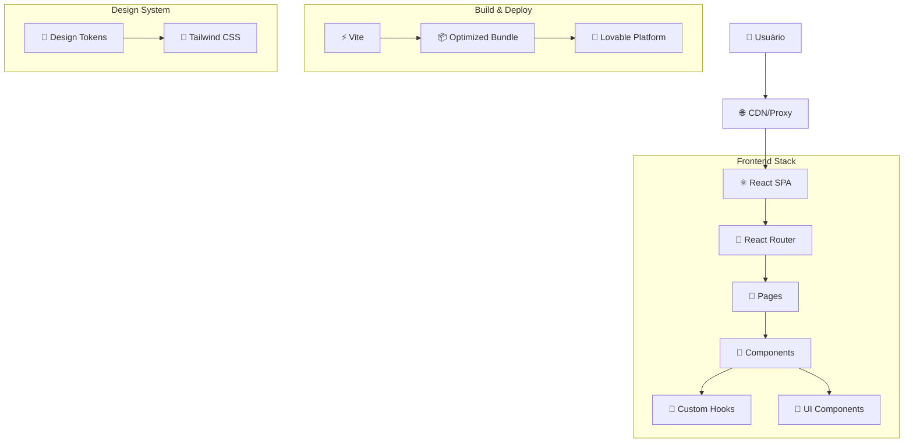
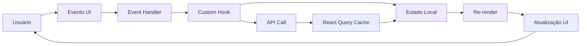
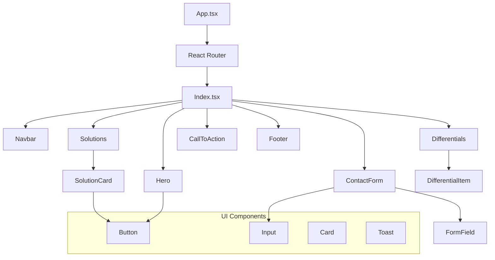
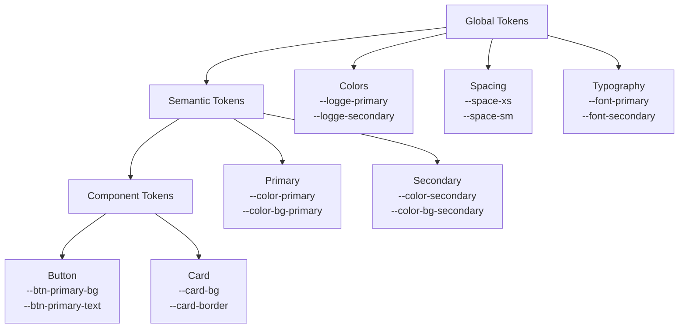
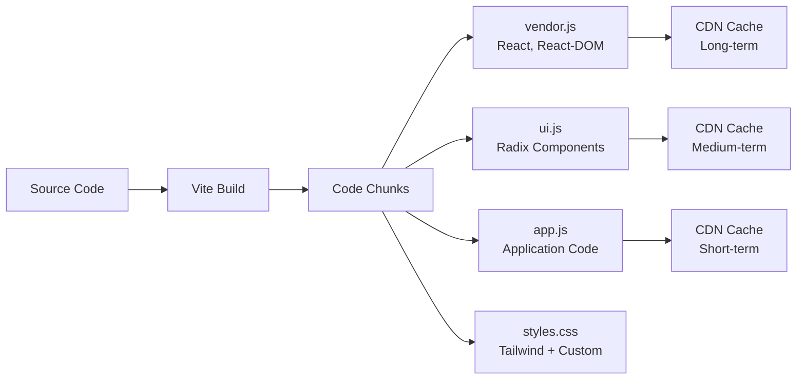

# Arquitetura Técnica - Logge Tecnologia

## 🏗️ Visão Arquitetural

A aplicação Logge Tecnologia foi projetada seguindo princípios de arquitetura moderna, priorizando escalabilidade, manutenibilidade e performance. Este documento detalha as decisões arquiteturais e padrões implementados.

## 📐 Diagramas Arquiteturais

### Arquitetura de Alto Nível



### Fluxo de Dados



### Estrutura de Componentes



## 🎯 Princípios Arquiteturais

### 1. Component-Driven Development

**Filosofia**: Cada componente possui uma responsabilidade única e bem definida.

```typescript
// Exemplo: Separação clara de responsabilidades
const SolutionCard = ({ title, description, icon }: SolutionCardProps) => {
  // Apenas apresentação - sem lógica de negócio
  return (
    <Card className="card-hover">
      <CardHeader>
        <Icon name={icon} />
        <CardTitle>{title}</CardTitle>
      </CardHeader>
      <CardContent>
        <p>{description}</p>
      </CardContent>
    </Card>
  );
};
```

### 2. Design System First

**Implementação**: Todos os estilos derivam de tokens semânticos centralizados.

```css
/* Design tokens centralizados */
:root {
  --logge-primary: #1EAEDB;
  --logge-secondary: #0E76A8;
  --spacing-unit: 8px;
  --border-radius: 8px;
}

/* Classes utilitárias derivadas */
.btn-primary {
  background-color: var(--logge-primary);
  padding: calc(var(--spacing-unit) * 1.5);
  border-radius: var(--border-radius);
}
```

### 3. Performance by Design

**Estratégias implementadas**:

1. **Code Splitting automático via Vite**
2. **Lazy loading de imagens**
3. **Otimização de bundle com tree-shaking**
4. **Memoização estratégica de componentes**

### 4. Accessibility First

**Implementação através de Radix UI**:
- Componentes semanticamente corretos
- Suporte a navegação por teclado
- Screen reader compatibility
- Focus management automático

## 📦 Camadas Arquiteturais

### Presentation Layer (Apresentação)

```
src/components/
├── ui/              # Componentes primitivos (shadcn/ui)
├── layout/          # Componentes de layout
├── sections/        # Seções específicas da landing page
└── forms/           # Componentes de formulário
```

**Responsabilidades**:
- Renderização de UI
- Handling de eventos de usuário
- Validação de entrada (formulários)
- Animações e transições

### Business Logic Layer (Lógica de Negócio)

```
src/hooks/
├── useScrollReveal.ts    # Lógica de animações
├── use-mobile.tsx        # Detecção de dispositivos
└── use-toast.ts          # Sistema de notificações
```

**Responsabilidades**:
- Lógica de animações
- Gerenciamento de estado
- Interações complexas
- Validações de negócio

### Data Layer (Dados)

```
src/lib/
└── utils.ts         # Funções utilitárias
```

**Responsabilidades**:
- Transformação de dados
- Utilidades de formatação
- Helpers diversos

### Configuration Layer (Configuração)

```
├── tailwind.config.ts   # Configuração do design system
├── vite.config.ts       # Build configuration
└── src/index.css        # Tokens e estilos globais
```

## 🔧 Padrões de Design

### 1. Compound Components

```typescript
// Exemplo: Card compound component
<Card>
  <Card.Header>
    <Card.Title>Título</Card.Title>
    <Card.Description>Descrição</Card.Description>
  </Card.Header>
  <Card.Content>
    Conteúdo
  </Card.Content>
  <Card.Footer>
    <Button>Ação</Button>
  </Card.Footer>
</Card>
```

### 2. Render Props Pattern (via Radix UI)

```typescript
<Dialog>
  <Dialog.Trigger asChild>
    <Button variant="outline">Abrir Dialog</Button>
  </Dialog.Trigger>
  <Dialog.Content>
    <Dialog.Header>
      <Dialog.Title>Título</Dialog.Title>
    </Dialog.Header>
  </Dialog.Content>
</Dialog>
```

### 3. Custom Hooks Pattern

```typescript
// Hook reutilizável para scroll reveal
const useScrollReveal = (threshold = 0.1) => {
  const [isVisible, setIsVisible] = useState(false);
  const ref = useRef<HTMLDivElement>(null);

  useEffect(() => {
    const observer = new IntersectionObserver(/* ... */);
    // Logic implementation
  }, [threshold]);

  return { ref, isVisible };
};

// Uso em múltiplos componentes
const Hero = () => {
  const { ref, isVisible } = useScrollReveal();
  return <section ref={ref} className={isVisible ? 'revealed' : ''}>;
};
```

### 4. Composition Pattern

```typescript
// Composição flexível de layouts
const Layout = ({ children }: { children: React.ReactNode }) => (
  <div className="min-h-screen flex flex-col">
    <Navbar />
    <main className="flex-1">{children}</main>
    <Footer />
  </div>
);

// Uso
<Layout>
  <Hero />
  <Solutions />
  <CallToAction />
</Layout>
```

## 🎨 Design System Architecture

### Token Hierarchy



### Component Variants System

```typescript
// Usando class-variance-authority (CVA)
const buttonVariants = cva(
  // Base styles
  "inline-flex items-center justify-center rounded-md font-medium transition-colors",
  {
    variants: {
      variant: {
        default: "bg-logge-primary text-white hover:bg-logge-primary/90",
        secondary: "bg-logge-secondary text-white hover:bg-logge-secondary/90",
        outline: "border border-logge-primary text-logge-primary hover:bg-logge-primary/10",
      },
      size: {
        sm: "h-9 px-3 text-sm",
        md: "h-10 px-4",
        lg: "h-11 px-8",
      }
    },
    defaultVariants: {
      variant: "default",
      size: "md",
    }
  }
);
```

## 📱 Responsive Architecture

### Breakpoint Strategy

```typescript
// tailwind.config.ts
const screens = {
  'sm': '640px',   // Mobile landscape
  'md': '768px',   // Tablet portrait
  'lg': '1024px',  // Tablet landscape / Small desktop
  'xl': '1280px',  // Desktop
  '2xl': '1536px'  // Large desktop
};
```

### Mobile-First Implementation

```typescript
// Padrão: Mobile first, depois desktop
<div className="
  flex flex-col gap-4        // Mobile: stack vertical
  md:flex-row md:gap-8       // Tablet+: horizontal layout
  lg:gap-12                  // Desktop: mais espaçamento
">
  <Card className="
    w-full                   // Mobile: full width
    md:w-1/2                 // Tablet: metade da largura
    lg:w-1/3                 // Desktop: um terço
  ">
    Content
  </Card>
</div>
```

## ⚡ Performance Architecture

### Bundle Optimization Strategy



### Loading Strategy

```typescript
// 1. Critical path loading
import React from 'react';
import { Navbar } from './components/Navbar';
import { Hero } from './components/Hero';

// 2. Lazy loading non-critical
const ContactForm = lazy(() => import('./components/ContactForm'));
const Footer = lazy(() => import('./components/Footer'));

// 3. Preload on user interaction
const handleScrollNearForm = () => {
  import('./components/ContactForm');
};
```

### Animation Performance

```css
/* GPU acceleration para animações críticas */
.scroll-reveal {
  transform: translate3d(0, 32px, 0); /* Force GPU */
  transition: transform 0.7s ease-out, opacity 0.7s ease-out;
  will-change: transform, opacity; /* Hint to browser */
}

.scroll-reveal.revealed {
  transform: translate3d(0, 0, 0);
}
```

## 🔐 Security Architecture

### Content Security Policy

```javascript
// Recomendação para headers HTTP
{
  "Content-Security-Policy": [
    "default-src 'self'",
    "script-src 'self' 'unsafe-inline' https://fonts.googleapis.com",
    "style-src 'self' 'unsafe-inline' https://fonts.googleapis.com",
    "font-src 'self' https://fonts.gstatic.com",
    "img-src 'self' data: https:",
    "connect-src 'self'"
  ].join('; ')
}
```

### Input Sanitization

```typescript
// Sanitização automática via React
const ContactForm = () => {
  const handleSubmit = (data: FormData) => {
    // React automaticamente escapa XSS
    // Validação adicional via Zod
    const sanitized = contactSchema.parse(data);
    submitForm(sanitized);
  };
};
```

## 📊 Monitoring Architecture

### Performance Monitoring

```typescript
// Web Vitals integration
import { getCLS, getFID, getFCP, getLCP, getTTFB } from 'web-vitals';

const reportWebVitals = (metric: Metric) => {
  // Enviar métricas para analytics
  analytics.track('performance', {
    name: metric.name,
    value: metric.value,
    rating: metric.rating
  });
};

getCLS(reportWebVitals);
getFID(reportWebVitals);
getFCP(reportWebVitals);
getLCP(reportWebVitals);
getTTFB(reportWebVitals);
```

### Error Boundaries

```typescript
class ErrorBoundary extends Component {
  constructor(props) {
    super(props);
    this.state = { hasError: false };
  }

  static getDerivedStateFromError(error) {
    return { hasError: true };
  }

  componentDidCatch(error, errorInfo) {
    // Log do erro para monitoramento
    console.error('Error caught by boundary:', error, errorInfo);
  }

  render() {
    if (this.state.hasError) {
      return <ErrorFallback />;
    }
    return this.props.children;
  }
}
```

## 🔄 State Management Architecture

### Local State Strategy

```typescript
// Estado local com useState
const ContactForm = () => {
  const [formData, setFormData] = useState(initialState);
  const [isSubmitting, setIsSubmitting] = useState(false);
  
  // Lógica isolada no componente
};

// Estado compartilhado via Context (quando necessário)
const ThemeContext = createContext();
const useTheme = () => useContext(ThemeContext);
```

### Server State (React Query)

```typescript
// Preparado para expansion com APIs
const useContactSubmission = () => {
  return useMutation({
    mutationFn: (data: ContactFormData) => 
      fetch('/api/contact', { method: 'POST', body: JSON.stringify(data) }),
    onSuccess: () => {
      toast.success('Mensagem enviada com sucesso!');
    },
    onError: (error) => {
      toast.error('Erro ao enviar mensagem');
    }
  });
};
```

## 🚀 Scalability Considerations

### Future-Proof Architecture

1. **Component Library Ready**: Base sólida para extrair design system
2. **API Integration Ready**: React Query configurado para expansion
3. **Routing Prepared**: React Router para múltiplas páginas
4. **State Management Scalable**: Context + React Query combination
5. **Build Optimization**: Vite configurado para projetos grandes

### Migration Paths

```typescript
// Preparado para Next.js migration
const getStaticProps = async () => {
  // SSG ready structure
  return { props: { solutionsData } };
};

// Preparado para micro-frontends
const ModuleFederationPlugin = {
  name: 'logge-landing',
  exposes: {
    './Hero': './src/components/Hero',
    './Solutions': './src/components/Solutions'
  }
};
```

---

*Esta arquitetura garante uma base sólida, escalável e manutenível para o crescimento futuro da aplicação* 🏗️