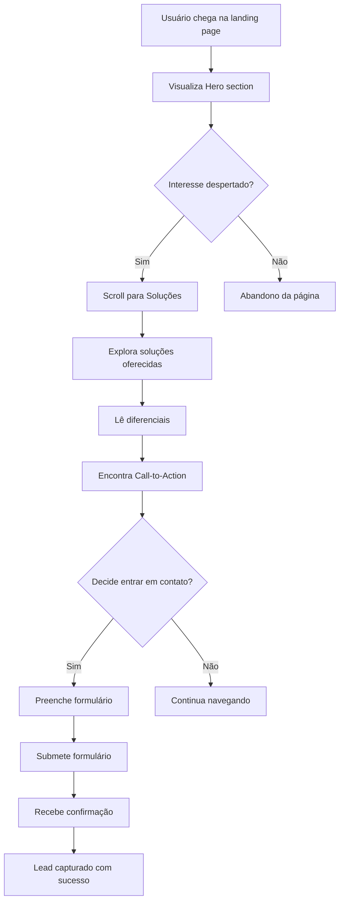

# Documentação Técnica - Logge Tecnologia

## 📋 Status do Checklist

- [x] **Análise da Arquitetura**: Estrutura de pastas, padrões e tecnologias utilizadas
- [x] **Mapeamento de Componentes**: Funcionalidades e responsabilidades de cada componente
- [x] **Fluxos de Usuário**: Jornadas e interações principais da aplicação
- [x] **Sistema de Design**: Tokens, animações e padrões visuais implementados
- [x] **Dependências e Configurações**: Bibliotecas, build e deployment
- [x] **Guias de Desenvolvimento**: Setup, convenções e melhores práticas

---

## 🎯 Visão Geral do Projeto

A aplicação da **Logge Tecnologia** é uma landing page corporativa desenvolvida em React que apresenta os serviços de consultoria da empresa. O projeto utiliza tecnologias modernas para criar uma experiência de usuário fluida e responsiva, com foco em conversão e engajamento.

### Objetivo do Negócio
- Apresentar os serviços de consultoria especializada
- Capturar leads através de formulários de contato
- Demonstrar diferenciais competitivos
- Facilitar agendamento de consultorias gratuitas

---

## 🏗️ Arquitetura Técnica

### Stack Tecnológico

| Tecnologia | Versão | Propósito |
|------------|--------|-----------|
| **React** | ^18.3.1 | Framework principal para UI |
| **TypeScript** | ^5.5.3 | Tipagem estática e maior robustez |
| **Vite** | ^5.4.1 | Bundler e dev server |
| **Tailwind CSS** | ^3.4.11 | Framework CSS utilitário |
| **Radix UI** | ^1.x | Componentes acessíveis e headless |
| **React Router DOM** | ^6.26.2 | Roteamento SPA |
| **React Query** | ^5.56.2 | Gerenciamento de estado server |
| **React Hook Form** | ^7.53.0 | Gerenciamento de formulários |
| **Lucide React** | ^0.462.0 | Biblioteca de ícones |

### Estrutura de Diretórios

```
src/
├── components/           # Componentes React
│   ├── ui/              # Componentes base (shadcn/ui)
│   ├── Hero.tsx         # Seção hero da landing page
│   ├── Navbar.tsx       # Navegação principal
│   ├── Solutions.tsx    # Apresentação de soluções
│   ├── Differentials.tsx # Diferenciais competitivos
│   ├── CallToAction.tsx # Chamadas para ação
│   ├── ContactForm.tsx  # Formulário de contato
│   └── Footer.tsx       # Rodapé
├── hooks/               # Hooks customizados
│   ├── useScrollReveal.ts # Animações de scroll reveal
│   ├── use-mobile.tsx   # Detecção de dispositivos móveis
│   └── use-toast.ts     # Sistema de notificações
├── lib/                 # Utilitários e helpers
│   └── utils.ts         # Funções utilitárias
├── pages/               # Páginas da aplicação
│   ├── Index.tsx        # Página principal
│   └── NotFound.tsx     # Página 404
├── App.tsx             # Componente raiz
├── main.tsx            # Entry point
└── index.css           # Estilos globais e design tokens
```

### Padrões Arquiteturais

1. **Component-Driven Development**: Cada componente tem responsabilidade única
2. **Design System First**: Uso de tokens semânticos e componentes reutilizáveis
3. **Mobile-First**: Design responsivo com breakpoints progressivos
4. **Performance-Oriented**: Lazy loading e otimizações de renderização
5. **Accessibility-First**: Componentes Radix UI garantem conformidade WCAG

---

## 🧩 Componentes e Funcionalidades

### Componentes Principais

#### 1. **Navbar** (`src/components/Navbar.tsx`)
**Responsabilidades:**
- Navegação principal fixa no topo
- Menu hamburger responsivo para mobile
- Scroll spy com efeitos visuais
- Smooth scrolling para âncoras

**Estados:**
- `isMenuOpen`: Controle do menu mobile
- `isScrolled`: Detecção de scroll para efeitos visuais

**Funcionalidades:**
- Auto-hide padding ao fazer scroll
- Navegação smooth para seções
- Menu overlay para dispositivos móveis
- Destacamento visual da marca "Logge"

#### 2. **Hero** (`src/components/Hero.tsx`)
**Responsabilidades:**
- Apresentação principal da empresa
- Call-to-actions primários
- Primeira impressão visual

**Features:**
- Animações de scroll reveal escalonadas
- Gradient background personalizado
- Botões com microinterações
- Tipografia responsiva e balanceada

#### 3. **Solutions** (`src/components/Solutions.tsx`)
**Responsabilidades:**
- Apresentação das soluções oferecidas
- Cards informativos com hover effects
- Grid responsivo

**Estrutura:**
- Layout em grid adaptativo (1-3 colunas)
- Cards com animações de hover
- Ícones representativos das soluções

#### 4. **Differentials** (`src/components/Differentials.tsx`)
**Responsabilidades:**
- Destacar vantagens competitivas
- Construir confiança e autoridade
- Apresentação visual impactante

#### 5. **CallToAction** (`src/components/CallToAction.tsx`)
**Responsabilidades:**
- Conversão de leads
- Direcionamento para contato
- Reforço da proposta de valor

#### 6. **ContactForm** (`src/components/ContactForm.tsx`)
**Responsabilidades:**
- Captura de leads qualificados
- Validação de dados em tempo real
- Feedback visual para usuário

**Validações:**
- Campos obrigatórios
- Formato de email
- Mensagens de erro contextuais

#### 7. **Footer** (`src/components/Footer.tsx`)
**Responsabilidades:**
- Informações de contato
- Links secundários
- Credibilidade e profissionalismo

### Hooks Customizados

#### `useScrollReveal` (`src/hooks/useScrollReveal.ts`)
**Propósito:** Implementa animações baseadas na Intersection Observer API

**Parâmetros:**
- `threshold`: Porcentagem de visibilidade para trigger (padrão: 0.1)
- `rootMargin`: Margem do viewport para observação

**Retorno:**
- `ref`: Referência para o elemento DOM
- `isVisible`: Estado booleano de visibilidade

**Implementação:**
```typescript
const { ref, isVisible } = useScrollReveal(0.1, '0px 0px -50px 0px');
```

---

## 🎨 Sistema de Design

### Tokens de Design

O sistema de design está centralizado em `src/index.css` e `tailwind.config.ts`, utilizando variáveis CSS para manter consistência e facilitar manutenção.

#### Paleta de Cores

```css
/* Cores da marca Logge */
--logge-light-blue: #1EAEDB    /* Azul principal */
--logge-dark-blue: #0E76A8     /* Azul secundário */
--logge-gray-100: #F6F6F7      /* Cinza claro */
--logge-gray-400: #403E43      /* Cinza escuro */

/* Cores semânticas */
--primary: 195 82% 49%         /* HSL do azul principal */
--background: 0 0% 100%        /* Fundo claro */
--foreground: 222.2 84% 4.9%   /* Texto principal */
```

#### Tipografia

**Famílias:**
- **Montserrat**: Headings e títulos (font-montserrat)
- **Inter**: Corpo de texto e UI (font-inter)

**Escalas:**
- `section-title`: 3xl-4xl, font-bold, cor primária
- `section-subtitle`: xl, cor secundária, max-width controlado

#### Sistema de Sombras

```css
.shadow-soft: /* Sombra sutil com cor da marca */
.shadow-medium: /* Sombra média para cards */
.shadow-strong: /* Sombra forte para estados hover */
```

### Animações e Microinterações

#### Scroll Reveal System
```css
.scroll-reveal {
  opacity: 0;
  transform: translateY(32px);
  transition: all 0.7s ease-out;
}

.scroll-reveal.revealed {
  opacity: 1;
  transform: translateY(0);
}
```

#### Card Interactions
```css
.card-hover: /* Hover com escala e elevação */
.card-hover-subtle: /* Hover mais discreto */
```

#### Staggered Animations
- Delays progressivos (0ms, 100ms, 200ms, 300ms)
- Aplicados via classes `.scroll-reveal-stagger`

---

## 🔄 Fluxos de Usuário

### Fluxo Principal (Conversão)



### Fluxo de Navegação

1. **Landing**: Usuário acessa página principal (/)
2. **Scroll Navigation**: Navegação via scroll ou menu âncora
3. **Seções sequenciais**:
   - Hero → Solutions → Differentials → CTA → Contact
4. **Formulário de contato**: Ponto de conversão principal
5. **Footer**: Informações complementares

### Jornadas Críticas

#### Jornada do Lead Qualificado
1. **Descoberta**: Usuário encontra a empresa (orgânico/pago)
2. **Interesse**: Lê proposta de valor no Hero
3. **Consideração**: Explora soluções e diferenciais
4. **Ação**: Preenche formulário ou clica em CTA
5. **Conversão**: Torna-se lead qualificado

#### Jornada Mobile vs Desktop
- **Mobile**: Foco em navegação simplificada, menu hamburger
- **Desktop**: Navegação horizontal, mais espaço para conteúdo

---

## 📱 Responsividade e Performance

### Breakpoints

| Dispositivo | Breakpoint | Comportamento |
|-------------|------------|---------------|
| **Mobile** | < 768px | Stack vertical, menu hamburger |
| **Tablet** | 768px - 1024px | Grid 2 colunas, navegação adaptada |
| **Desktop** | > 1024px | Grid completo, navegação horizontal |

### Estratégias de Performance

1. **Bundle Splitting**: Vite automatiza code splitting
2. **Image Optimization**: Lazy loading nativo
3. **CSS Optimization**: Tailwind purge automático
4. **Script Optimization**: React 18 concurrent features
5. **Font Loading**: Google Fonts com display=swap

### Métricas Alvo

- **First Contentful Paint**: < 1.5s
- **Largest Contentful Paint**: < 2.5s
- **Cumulative Layout Shift**: < 0.1
- **Time to Interactive**: < 3s

---

## 🔧 Configuração e Setup

### Pré-requisitos

```bash
Node.js >= 18.0.0
npm >= 9.0.0 ou yarn >= 1.22.0
```

### Instalação Local

```bash
# Clone do repositório
git clone [repository-url]
cd logge-tecnologia

# Instalação de dependências
npm install

# Desenvolvimento local
npm run dev

# Build de produção
npm run build

# Preview da build
npm run preview
```

### Variáveis de Ambiente

```env
# Não há variáveis de ambiente necessárias para esta aplicação
# Todas as configurações são hardcoded por ser uma landing page estática
```

### Scripts Disponíveis

| Script | Comando | Descrição |
|--------|---------|-----------|
| **dev** | `npm run dev` | Servidor de desenvolvimento |
| **build** | `npm run build` | Build otimizada para produção |
| **build:dev** | `npm run build:dev` | Build em modo desenvolvimento |
| **lint** | `npm run lint` | Verificação de lint |
| **preview** | `npm run preview` | Preview da build local |

---

## 🚀 Deploy e CI/CD

### Estratégia de Deploy

1. **Plataforma**: Lovable Platform (padrão)
2. **Alternativas**: Netlify, Vercel, GitHub Pages
3. **Build**: Automática via Git push
4. **CDN**: Global com cache otimizado

### Processo de Deploy

```bash
# Build otimizada
npm run build

# Arquivos gerados em /dist
# Deploy automático via plataforma Lovable
```

### Configurações de Produção

- **Vite Build**: Otimização automática de assets
- **Tailwind Purge**: Remoção de CSS não utilizado
- **Tree Shaking**: Eliminação de código morto
- **Asset Optimization**: Compressão de imagens e fonts

---

## 🧪 Testes e Qualidade

### Estratégia de Testes

**Testes atualmente não implementados** - Recomendações:

1. **Unit Tests**: Jest + React Testing Library
2. **Integration Tests**: Cypress ou Playwright
3. **Visual Tests**: Storybook + Chromatic
4. **Performance Tests**: Lighthouse CI

### Code Quality

- **ESLint**: Configuração com regras React e TypeScript
- **TypeScript**: Tipagem estrita habilitada
- **Prettier**: Formatação automática de código
- **Git Hooks**: Pre-commit com lint-staged (recomendado)

### Métricas de Qualidade

- **TypeScript Coverage**: 100%
- **Component Reusability**: Alta (design system)
- **Bundle Size**: Otimizado com tree-shaking
- **Accessibility**: Radix UI garante padrões WCAG

---

## 🔒 Segurança e Conformidade

### Considerações de Segurança

1. **Content Security Policy**: Configurável via headers
2. **XSS Protection**: React escapa automaticamente
3. **HTTPS**: Obrigatório em produção
4. **Dependências**: Auditoria regular com `npm audit`

### Conformidade

- **LGPD/GDPR**: Formulário de contato requer consentimento
- **Acessibilidade**: Componentes Radix UI são WCAG AA compliant
- **SEO**: Meta tags otimizadas para mecanismos de busca

---

## 📊 Monitoramento e Analytics

### Métricas Recomendadas

1. **Performance**: Web Vitals via Lighthouse
2. **User Behavior**: Google Analytics 4
3. **Error Tracking**: Sentry ou similar
4. **Conversion**: Formulário de contato e CTAs

### KPIs Sugeridos

- **Taxa de Conversão**: Formulários preenchidos / Visitantes
- **Bounce Rate**: < 40%
- **Time on Page**: > 2 minutos
- **Mobile Usage**: Acompanhar trend mobile-first

---

## 🚀 Próximos Passos e Melhorias

### Roadmap Técnico

#### Fase 1: Otimização (Curto Prazo)
- [ ] Implementar testes automatizados
- [ ] Configurar CI/CD pipeline
- [ ] Adicionar analytics e tracking
- [ ] Otimizar imagens (WebP/AVIF)

#### Fase 2: Features (Médio Prazo)
- [ ] Blog/Content Management
- [ ] Sistema de agendamento online
- [ ] Portal do cliente
- [ ] Integração com CRM

#### Fase 3: Expansão (Longo Prazo)
- [ ] Múltiplos idiomas (i18n)
- [ ] Progressive Web App (PWA)
- [ ] Personalização de conteúdo
- [ ] Integração com ferramentas de marketing

### Melhorias Sugeridas

1. **Performance**:
   - Implementar Service Workers
   - Otimizar Critical Rendering Path
   - Adicionar preloading estratégico

2. **UX/UI**:
   - A/B testing para CTAs
   - Micro-animações avançadas
   - Scroll progress indicator

3. **Funcionalidade**:
   - Chatbot integrado
   - Calculadora de ROI
   - Cases de sucesso dinâmicos

---

## 📚 Recursos e Referências

### Documentação das Tecnologias

- [React Documentation](https://react.dev/)
- [Vite Guide](https://vitejs.dev/guide/)
- [Tailwind CSS Docs](https://tailwindcss.com/docs)
- [Radix UI Primitives](https://www.radix-ui.com/primitives)

### Ferramentas de Desenvolvimento

- [VS Code](https://code.visualstudio.com/) + Extensões React
- [React Developer Tools](https://react.dev/learn/react-developer-tools)
- [Tailwind CSS IntelliSense](https://marketplace.visualstudio.com/items?itemName=bradlc.vscode-tailwindcss)

### Comunidade e Suporte

- [Lovable Discord](https://discord.gg/lovable)
- [React Community](https://react.dev/community)
- [Tailwind CSS Discord](https://tailwindcss.com/discord)

---

## 👥 Contribuição e Manutenção

### Guidelines de Contribuição

1. **Código**: Seguir padrões estabelecidos
2. **Commits**: Conventional Commits
3. **Pull Requests**: Template estruturado
4. **Documentação**: Manter sempre atualizada

### Responsabilidades

- **Frontend**: Manutenção de componentes e UX
- **Design System**: Evolução consistente de tokens
- **Performance**: Monitoramento e otimização contínua
- **Conteúdo**: Atualizações de texto e imagens

---

*Documentação gerada em: Setembro 2025*
*Versão da aplicação: 1.0.0*
*Última atualização: 20/09/2025*